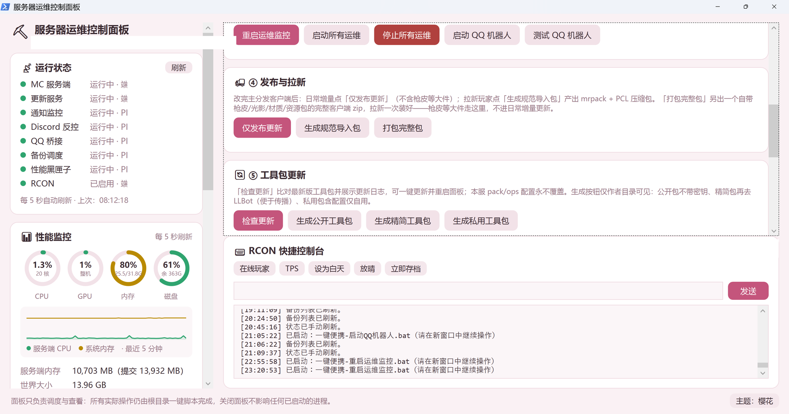
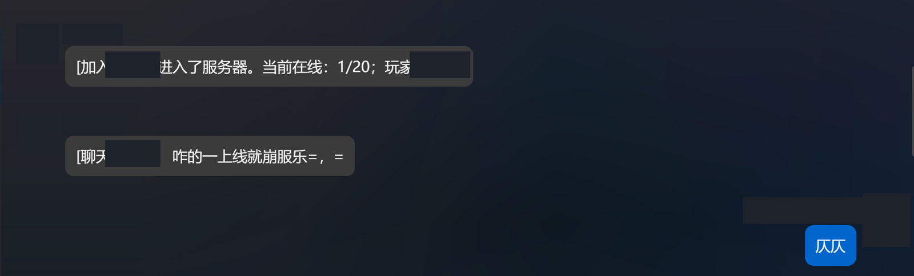
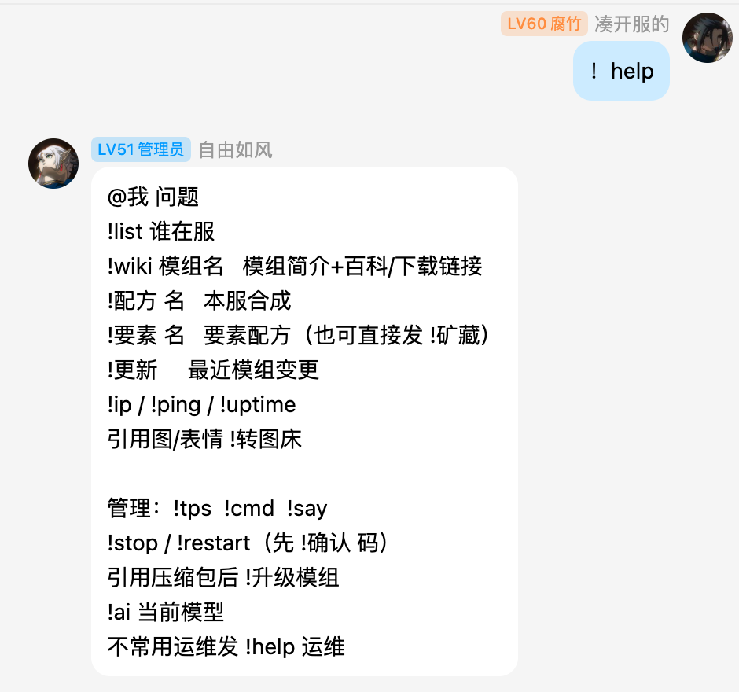
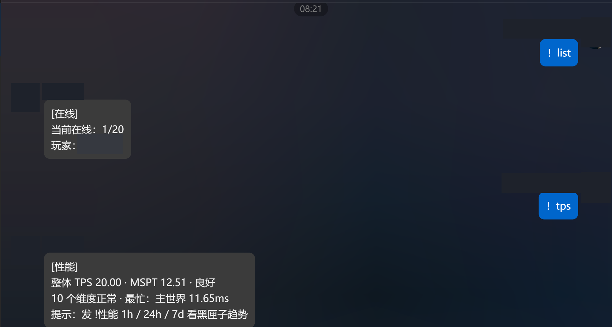
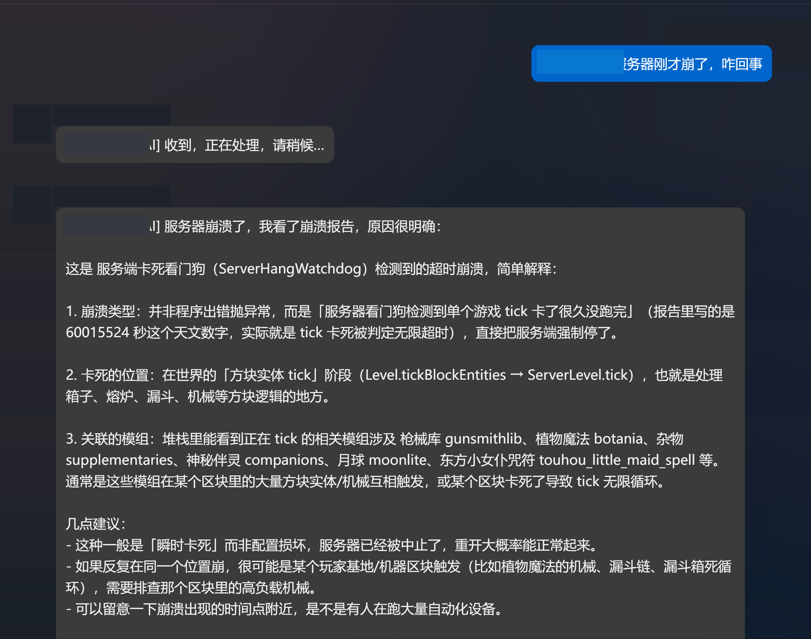

# Minecraft 腐竹运维工具包

面向 Minecraft Java 服务端服主（腐竹）的便携式运维工具包。

它把开服、玩家整合包分发、增量更新、QQ 群运维、备份恢复、性能诊断和日常管理收进一个可迁移目录。项目源自 1.21.1 NeoForge 21.1.235 的长期实战，但脚本会优先读取目标服务端的实际版本和加载器，不把某一台服务器的身份配置写死在公版里。

## 适合谁

- 自己维护 Minecraft Java 服务端的个人服主
- 需要把整合包、更新源和服务端运维流程标准化的服主
- 想把“出问题时临时手工排查”变成可复用脚本和报告的人
- 需要中文一键入口，但不想被某个启动器或某个加载器锁定的人

## 主要能力

### 服务端控制与配置

- 中文控制面板：启动、停止、重启、RCON 快捷控制台、更新发布和状态查看
- 初始化向导：自动识别 Minecraft 版本、Forge/NeoForge/Fabric/Quilt、服务端端口和主客户端目录
- Java 自动匹配：按 Minecraft 版本选择合适的 Java，并在缺少时给出下载指引
- 本地 RCON 自动配置：生成或轮换密码，敏感值不写入公版模板
- 公版、精简包和玩家拉新包构建器

真实运行中的控制面板如下，启动、运维监控、发布/拉新、工具包更新和 RCON 快捷控制台都集中在同一个入口：



### 玩家分发与更新

- 生成规范导入包、PCL 包、完整客户端包和增量更新源
- Windows、macOS、Linux 玩家同步脚本
- 首次同步和日常增量同步分开处理，尽量保留玩家自己的按键、服务器列表、资源包和个性化文件
- 文件哈希校验、混合源回退、客户端自助修复和诊断编号
- PCL 本地实例目录识别与启动配置修复

### QQ 群运维

- QQ 群通知：开服、停服、上线、离线、聊天、死亡、成就、崩溃、备份和更新
- 权限分层：普通群友查询，群主/管理员执行高危操作
- RCON 命令、备份、存盘、天气、种子、在线列表和 TPS 查询
- 高危操作确认码、审计记录和重复操作保护
- 可选 AI 运维助手：读取日志、崩溃报告、模组列表、配置和性能信息，帮助定位问题
- 可选 DDNS、图片转发、模组发布事务和摄像机视角能力

QQ 与 Minecraft 的实际双向消息链路如下：




#### 反控指令集合

`!help` 汇总了普通查询、信息检索、管理操作和需要确认码的高危操作，可以直观看到权限边界：



#### QQ 反控查询

`!list`、`!tps` 等无破坏查询可以从 QQ 发起，并由机器人返回在线玩家和性能信息；高危操作仍受权限和确认流程约束。



#### AI 运维助手

在群内 @ 机器人并描述服务器异常后，AI 助手可以结合看门狗/崩溃报告给出故障类型、卡顿位置、关联模组和排查建议。



QQ/LLBot 程序本体和 QQ 客户端不随源码仓库分发。需要 QQ 机器人时，在目标机器按文档自行安装，并在本机配置登录信息。

### 真实界面演示

首页已在对应能力段落中嵌入关键截图；完整的截图说明、脱敏范围和实际交互边界见[真实界面演示](docs/live-ui-demo.md)。展示图只保留能力验证所需内容，本机路径、端口/PID、地址和凭据已脱敏；反控指令集合图保留了示例角色标签、昵称和头像，用于说明权限分层。

### 备份与故障诊断

- 定时备份、手动备份、混合压缩和保留策略
- 备份可验证：检查 ZIP、`level.dat`、区域文件、玩家档和可选深度抽样
- 备份恢复冒烟测试和影子服试车间
- 卡顿取证、MSPT/TPS 黑匣子、线程转储和错误指纹告警
- 事故自动复盘、运维时间线和周期运行报告
- BlueMap 时光机：只刷新快照元数据，不复制线上瓦片
- 扫地僧实体清理、配方索引、要素物品反查等可选工具

高风险功能在公版模板中默认关闭，需要服主明确配置后才会启用。

## 快速开始

### 1. 获取源码或公版压缩包

将仓库内容放到 Minecraft 服务端根目录，或使用构建器生成 `dist/` 下的公版压缩包，再解压到服务端根目录。

工具包不要求服务端已经存在 `server.properties`；新服可以先解压，再运行初始化向导。

### 2. 初始化配置

在服务端根目录运行：

```text
一键脚本\一键便携-初始化配置.bat
```

第一次使用建议选择逐项确认。向导会检测目标服务端的版本、加载器、端口、世界名和主客户端目录，并把结果写入本机配置文件：

```text
tools\portable-pack.json
tools\ops-config.json
```

这两份文件是本机私有配置，不应提交到 Git 或发给别人。

### 3. 启动服务端

```text
一键脚本\一键便携-启动服务端.bat
```

日常启动、重启运维监控、停止运维监控和控制台操作都可以从根目录控制面板完成。

### 4. 发布玩家更新

确认主客户端目录和更新源配置后运行：

```text
一键脚本\一键便携-生成规范导入包.bat
一键脚本\一键便携-开启更新服务.bat
```

玩家端按文档中的同步入口执行即可。公网更新服务必须使用你自己明确授权的域名、端口和访问策略。

## 目录结构

```text
.
├─ 一键便携-控制面板.bat       # 根目录唯一的控制面板入口
├─ 一键脚本/                   # 可单独双击的一键入口
├─ tools/                      # PowerShell、Python、Java 和 Node 工具
│  ├─ portable-pack.example.json
│  ├─ portable-ops-config.example.json
│  └─ ...
├─ docs/                       # 功能说明、排障手册和设计文档
├─ PUBLIC-RELEASE-AUDIT.md     # 公版边界和发布审计说明
└─ .gitignore                  # 私有配置和运行目录保护规则
```

详细运维手册见 [`docs/portable-server-kit.md`](docs/portable-server-kit.md)。

## 构建和验证公版

在仓库根目录运行公版构建器：

```powershell
powershell -NoProfile -ExecutionPolicy Bypass `
  -File .\tools\build-portable-server-kit.ps1 `
  -Version 20260816-public
```

构建器会执行：

- 公版文件白名单检查
- 私有配置和运行目录门禁
- 绝对用户路径和疑似密钥扫描
- PowerShell 编码与语法检查
- Windows `.bat` 换行和 BOM 检查
- 初始化菜单、QQ 桥、备份、更新和近期功能标记检查

生成物位于 `dist/`，该目录默认被 `.gitignore` 排除，不会进入源码提交。

可选的本地语法检查：

```powershell
python -m compileall -q .\tools

New-Item -ItemType Directory -Force .\tmp\javac-check | Out-Null
javac --add-modules jdk.httpserver -encoding UTF-8 `
  -d .\tmp\javac-check .\tools\QQConsoleBridge.java
```

## 公版隐私边界

本仓库只包含通用源码、模板、脚本和文档，明确不包含：

- 真实 Discord/QQ/AI/DDNS/API token、Webhook、密码和群号
- `tools/portable-pack.json`、`tools/ops-config.json` 等本机配置
- RCON 密码、更新服务 token 和本机绝对路径
- 世界、日志、备份、崩溃报告、玩家缓存、OP/白名单/封禁名单
- 私服客户端、模组、地图、存档和服务端运行时目录
- QQ 登录数据、登录二维码、QQ 客户端和第三方运行时数据

如果要提交问题报告，请先删除配置文件、日志中的域名/IP、玩家名、UUID、群号和 token。不要直接上传整个运行中的服务端目录。

## 安全建议

- 真实密钥优先使用环境变量或本机私有配置，不要写入脚本和模板
- RCON 只监听本机，并使用随机强密码
- 生产服操作前先备份，恢复前先做验证或影子服试车
- 不要以管理员身份运行一键入口，除非你明确知道自己在做什么
- 开启 AI、DDNS、图片上传、模组自动发布等功能前，先阅读对应文档并限制权限
- 公版构建前检查 `git status`，确认没有私有文件被加入暂存区

## 贡献

欢迎提交 Issue、文档改进和 Pull Request。

提交前请确认：

1. 不包含任何服务器身份信息、玩家信息或凭据。
2. 新增功能在公版模板中默认安全关闭，或明确说明风险。
3. PowerShell 脚本保存为 UTF-8，Windows `.bat` 保持 CRLF 且不带 BOM。
4. 运行公版构建器和相关语法检查。
5. 说明测试环境、Minecraft 版本和加载器版本。

## 许可证与第三方组件

本项目的正式许可证将在首次公开发布前补充。仓库中的第三方依赖、QQ/LLBot、Minecraft 模组和启动器不等同于本项目代码，使用和再分发时请遵守各自许可证及服务条款。
