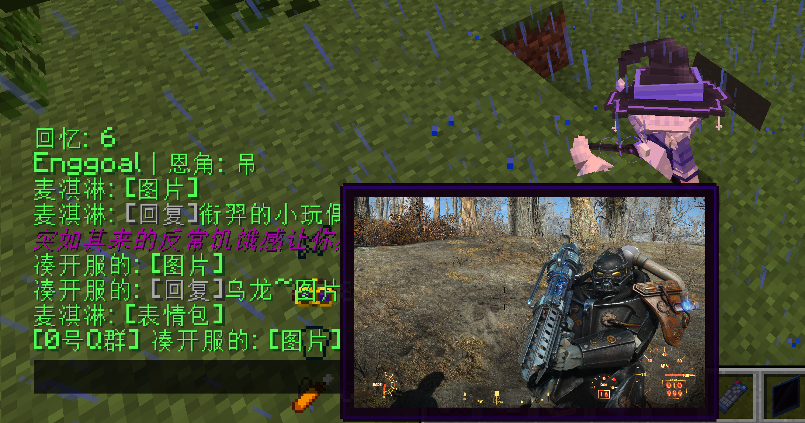
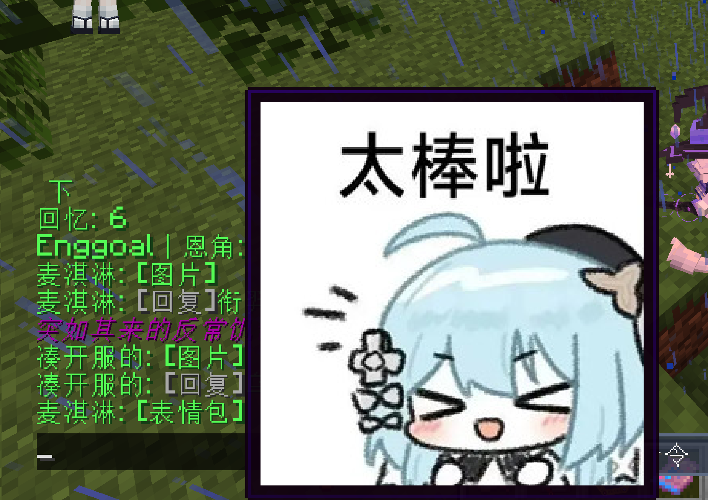

# PF-GUGUBot 功能核查与跟进方案

> 核查日期：2026-08-18
> 核查对象：[PF-GUGUBot](https://github.com/PFingan-Code/PF-GUGUBot)  `main` 分支
> 对照项目：本项目的 `QQConsoleBridge` 与 QQ/Minecraft 同步链路

## 当前落地状态

本次已在 [QQConsoleBridge.java](../tools/QQConsoleBridge.java) 落地第一阶段，并补齐本机图床闭环：

- 已保留 OneBot `message` 数组，并兼容只有 `raw_message` 的旧输入。
- 已加入 `text/image/face/mface/marketface/bface/at/reply/file/video/forward` 等消息段的统一解析与降级。
- 普通主群 QQ → Minecraft 已不再直接调用 `stripCQ` 丢弃媒体；文本、图片、表情名称、@ 和其他消息段会按顺序渲染到 `tellraw`。
- 图片/动画表情在 `imageHost.enabled=true`、`autoRelay=true` 且令牌有效时，会进入独立单线程队列：下载、校验、按内容哈希上传本机图床，并缓存同源/同内容结果；失败时回退为原图链接，不吞掉整条消息。
- 普通图片与表情包会保留语义标签：`image` 普通图片显示 `[图片]`，动画/商城表情及带表情子类型的图片显示 `[表情包]`；两者都走同一条图床转存链路。
- 已新增标准库实现的 [image-host-server.py](../tools/image-host-server.py) 与启动/停止脚本，上传接口为 `/upload`，预览地址为 `/i/<sha256>.<ext>`，默认只监听 `127.0.0.1`。
- Minecraft 图片显示模式可配置为 `link`、`chatimage` 或 `imagepreviewer`。其中 `link` 不需要额外客户端能力；`chatimage` 会发送 `CICode`，由安装 ChatImage 的客户端直接预览远程图片；`imagepreviewer` 只适合 Paper/Spigot 插件链路。
- Minecraft → QQ 现有文本、图片、视频和合并转发发送路径未改动；统一结构化发送出口仍属于后续阶段。

## 本次实战更新（2026-08-18）

已在真实 NeoForge 1.21.1 / 21.1.235 服务端验证：QQ 普通图片、GIF 和表情包均可自动下载并上传到兼容的 MC 图床，再以 Minecraft 客户端可访问的地址转发。生产配置应保持“上传走服务器本机回环地址、游戏聊天使用公链地址”的分工；公版模板只保留示例域名，不写入实际服务器域名、IP 或令牌。

本次还补上了 QQ 图片事件中常见的 `summary`、`subType`/`sub_type` 与 GIF/WebP/APNG 后缀判断，避免把表情包错误标成普通图片。已验证图床上传、公开地址读取、删除清理、自动转存、图片/表情包标签渲染，以及 `chatimage` 模式下远程公链 URL 生成 `CICode`；消息转发仍使用有界单线程队列，以保证多段消息的顺序，重复图片则命中缓存。

### 实际游戏内预览截图

以下是本次真实 NeoForge 1.21.1 / 21.1.235 服务端的 ChatImage 预览结果：普通 QQ 图片显示为`[图片]`，QQ 表情包显示为`[表情包]`，两者均由公网图链驱动，玩家客户端直接触发预览。





## 结论先行

PF-GUGUBot 所谓“支持图片、表情等 Q 群和服务器聊天转发”，核心并不是把 QQ 的图片直接嵌入原版 Minecraft，而是做了三件事：

1. 使用 OneBot WebSocket 接收 QQ 消息，并把 CQ 字符串或 OneBot 消息数组解析成统一的消息段。
2. 在 QQ 到 Minecraft 的方向，把图片、表情、@ 等消息段转换为 Minecraft 可显示的文本组件、悬浮提示、点击链接或第三方客户端插件指令。
3. 在 Minecraft 到 QQ 的方向，保留消息段结构，通过 OneBot 的 `send_group_msg` 等接口发送文本、图片、视频或转发消息。

因此我们可以跟进，而且本项目已经具备 OneBot WebSocket、HTTP API、图片上传、图片/视频/合并转发等基础能力。现在的做法是在现有连接层上补“消息段解析、图片资源稳定化和目标端渲染”，不重做 QQ 连接层。

建议：借鉴它的消息模型和渲染思路，独立实现到本项目，不直接复制其源代码。原因是上游是 GPL-3.0，本项目当前是 PolyForm Noncommercial License，存在许可证兼容和再分发风险。

## 1. 上游项目到底是如何实现的

### 1.1 总体链路

```text
QQ 客户端
    │
    ▼
NapCat / LLOneBot（OneBot）
    │  WebSocket 事件；HTTP API 发消息
    ▼
PF-GUGUBot QQ Parser
    │  CQ 字符串 / 消息数组
    ▼
统一消息段列表
    │  text / image / face / at / reply / ...
    ├──────────────────────────────┐
    ▼                              ▼
Minecraft 消息构造器                 QQ Connector
    │                              │
    ▼                              ▼
RText、悬浮、点击、插件预览             OneBot 消息段数组
```

主要证据：

- [QQ Parser](https://github.com/PFingan-Code/PF-GUGUBot/blob/main/GUGUbot/gugubot/parser/qq_parser.py)：接收 OneBot 事件，兼容 `raw_message` 字符串和 `message` 数组。
- [Message Builder](https://github.com/PFingan-Code/PF-GUGUBot/blob/main/GUGUbot/gugubot/builder/message_builder.py)：构造文本、@、图片、语音、表情等消息段。
- [MC Message Builder](https://github.com/PFingan-Code/PF-GUGUBot/blob/main/GUGUbot/builder/mc_builder.py)：把消息段转换成 Minecraft RText/插件命令。
- [QQ Connector](https://github.com/PFingan-Code/PF-GUGUBot/blob/main/GUGUbot/gugubot/connector/qq_connector.py)：把处理后的消息段重新交给 OneBot，按群消息发送。

### 1.2 输入格式：CQ 字符串或消息数组

OneBot 消息常见有两种表达方式：

```text
[CQ:at,qq=123456] 大家好 [CQ:image,file=abc,url=https://...]
```

或者：

```json
[
  {"type": "at", "data": {"qq": "123456"}},
  {"type": "text", "data": {"text": "大家好 "}},
  {"type": "image", "data": {"file": "abc", "url": "https://..."}}
]
```

PF-GUGUBot 先把两种输入归一为消息段列表，再由不同目标端分别渲染。这样做的关键价值是：中间层不会因为某个目标端暂时不支持图片，就把图片消息永久降级成不可恢复的纯文本。

### 1.3 图片是“可访问资源”，不是原版客户端内嵌位图

上游的图片处理大致分为三种情况：

| 场景 | Minecraft 侧表现 | 前提 |
| --- | --- | --- |
| 默认转发 | 显示图片提示文本，并附带悬浮 URL/点击打开 URL 的行为 | Minecraft 客户端可访问该 URL |
| ChatImage | 生成 `[[CICode,url=...,name=...]]`，由客户端在聊天中解析图片 | 每个要直接预览的玩家安装与当前 NeoForge 版本匹配的 ChatImage 客户端 Mod；远程 HTTP(S) 图链通常不要求服务端装同名插件，本地文件才需要服务端配套 |
| ImagePreviewer | 点击后执行 `/imagepreview preview <url> 60` | 它是 Paper/Spigot 服务端插件，并依赖 PacketEvents，不是 NeoForge 客户端 Mod；只有混合端或 Paper 服才适合这条路 |

上游文档明确说明：没有额外图片插件时，图片通常只能以链接形式展示；图片预览依赖 Minecraft 侧插件能力。参见 [PF-GUGUBot 疑难解答](https://pfingan-code.github.io/PF-GUGUBot/troubleshooting/)。ChatImage 的协议与平台说明见 [ChatImage Modrinth](https://modrinth.com/mod/chatimage)；ImagePreviewer 的服务端依赖见 [ImagePreviewer Spigot](https://www.spigotmc.org/resources/image-previewer%E2%80%8B-preview-images-in-chat-bar-with-ease-1-20-1-21-3.120888/)。

另外，上游关键词回复有单独的图片缓存逻辑，会把图片 URL 下载到本地缓存后再作为资源使用，参见[关键词图片缓存实现](https://github.com/PFingan-Code/PF-GUGUBot/blob/main/GUGUbot/gugubot/logic/system/key_word.py)。这不等于所有 QQ 图片都天然永久有效：QQ 图片 URL 可能过期、需要鉴权，或无法被玩家客户端访问。

### 1.4 表情是“ID 映射为文字”，不是原始 QQ 贴纸

普通 QQ 表情在上游主要通过表情 ID 映射表转换为类似以下内容：

```text
[表情: 呲牙]
```

如果没有匹配到映射，则降级为通用的 `[表情]`。因此它解决的是“消息语义可读”和“不会静默丢失”，并没有把 QQ 的原始贴纸二进制直接渲染到原版 Minecraft 中。

自定义表情映射位置和处理方式可参考上游[疑难解答中的表情说明](https://raw.githubusercontent.com/PFingan-Code/PF-GUGUBot/main/docs/troubleshooting.md)。

### 1.5 反向发送保留结构

Minecraft 或机器人生成回复时，上游 QQ Connector 会把消息段列表按 OneBot 格式发送。例如：

- 文本：`type=text`
- 图片：`type=image`
- 普通表情：`type=face`
- @：`type=at`
- 其他媒体：根据 OneBot 实现支持情况发送

这比把所有内容提前拼成一条字符串更有扩展性。当前上游的普通服务器聊天仍然主要是文本；图片、视频、转发等结构化消息通常用于机器人回复或特定业务。

## 2. 与本项目现状对照

### 2.1 已有能力

本项目已经具备以下基础设施：

- 通过 OneBot WebSocket 接收 QQ 群消息和事件。
- 通过 OneBot HTTP API 发送群消息。
- 发送图片、视频、合并转发消息的现成方法。
- 图片上传/托管链路，可用于把短期 QQ URL 转换成相对稳定的公网或内网资源地址。
- 权限、群过滤、命令路由、RCON、AI 上下文和日志审计能力。

实现和设计依据：

- [QQConsoleBridge.java](../tools/QQConsoleBridge.java#L489)：登录信息获取、WebSocket 连接。
- [QQConsoleBridge.java](../tools/QQConsoleBridge.java#L674)：处理 OneBot 群消息事件，读取 `raw_message` 或 `message`。
- [QQ/Minecraft/AI 架构说明](../docs/qq-bot-minecraft-ai-architecture.md#L69)：OneBot WebSocket、HTTP API、RCON 和双向消息链路。
- [QQConsoleBridge.java](../tools/QQConsoleBridge.java#L6432)：OneBot HTTP API。
- [QQConsoleBridge.java](../tools/QQConsoleBridge.java#L6495)：图片、合并转发和视频发送能力。

### 2.2 当前实现与边界

普通 QQ → Minecraft 聊天路径现在是：

```text
OneBot 事件
  ▼
读取 message 数组 / raw_message
  ▼
统一消息段列表
  ▼
图片下载、校验、图床转存（可选，失败回退）
  ▼
按 link / ChatImage / ImagePreviewer 渲染
  ▼
tellraw @a
```

相关代码：[QQConsoleBridge.java](../tools/QQConsoleBridge.java) 的 `messageSegments`、`prepareRelaySegments` 和 `renderMinecraftTellraw` 分别负责归一化、自动转存和渲染。因此：

| 消息类型 | 当前 QQ → Minecraft 结果 | 主要问题 |
| --- | --- | --- |
| 纯文本 | 可以正常转发 | 基本可用 |
| @某人 | 显示 `@QQ号` | 暂未反查昵称 |
| 图片 | 自动转存后显示图床链接、ChatImage CICode 或 ImagePreviewer 点击项 | 预览效果取决于 URL 可达性和客户端/服务端能力 |
| 普通表情 | 显示表情名称/ID；动画表情尝试转存 | QQ 私有表情格式可能没有可下载 URL |
| 回复/转发 | 显示 `[回复]`、`[合并转发]` 等安全摘要 | 尚未展开完整转发树 |
| QQ → Minecraft 混合消息 | 保持消息段顺序 | 每条消息最多渲染 32 段、文本 220 字符 |

而 Minecraft → QQ 方向已经有结构化发送的基础，所以当前仍优先完善 QQ → Minecraft 的资源稳定化和渲染细节。

## 3. 建议跟进方案

### P0：增加统一消息段模型

不要继续在 `String` 上堆叠更多正则。建议在桥接层内部定义最小、可扩展的消息段模型：

```text
MessageSegment
  type: text | image | face | mface | at | reply | file | video | forward | unknown
  data: 经过白名单过滤的键值数据
```

输入端同时支持：

1. OneBot 的 `message` 数组。
2. 旧实现常见的 `raw_message` CQ 字符串。
3. 解析失败时保留原始文本，不能因为一个未知 CQ 码导致整条消息消失。

最低验收标准：

- 混合文本、图片、表情、@ 的顺序保持不变。
- 文本中的 JSON 特殊字符、引号和换行不会破坏 `tellraw`。
- 未知消息段可降级为 `[不支持的消息]` 或安全文本。
- 解析层不负责决定最终显示样式，便于未来接入其他聊天端。

### P1：QQ → Minecraft 的可读渲染

第一阶段不追求原版客户端内嵌图片，先把信息完整、稳定地送到游戏内：

| 消息段 | 建议 Minecraft 表现 |
| --- | --- |
| `text` | 普通文本组件，严格 JSON 转义 |
| `image` | `[图片]` 或 `[图片: URL]`，悬浮显示 URL，点击打开；必要时先进入现有图片托管 |
| `face`/`mface` | `[表情: 名称]`，未知 ID 显示 `[表情]` |
| `at` | `@昵称`；查不到昵称时显示 `@QQ号` |
| `reply` | `[回复 某人]` 前缀，正文继续按消息段渲染 |
| `file`/`video` | 先显示安全下载链接或摘要，不直接暴露本地路径 |
| `forward` | 显示 `[合并转发]`，必要时展开为摘要或转发到 AI 上下文 |

现有 `relayQQChat` 使用 RCON `tellraw` 发送聊天，因此可以在不改变 QQ 连接层的情况下，替换“纯字符串拼接”为“Minecraft JSON 组件构造”。参见[QQConsoleBridge.java](../tools/QQConsoleBridge.java#L2103)。

### P1：图片资源稳定化与安全边界

QQ 图片 URL 不能默认视为长期资源。建议沿用现有图片托管能力，但增加明确的安全约束：

- 只接受 `http`/`https`，拒绝 `file://`、本地绝对路径和任意内网探测地址。
- 限制下载大小、超时时间、MIME 类型和并发数。
- 按内容哈希或短期缓存键去重，设置 TTL 和磁盘上限。
- 对外展示的 URL 使用 HTTPS 和可控域名。
- 不在 Minecraft 聊天中泄露 QQ 原始下载地址、访问令牌或本机路径。
- 图片不可用时显示可读的 `[图片不可用]`，不要阻塞整条聊天。

### P2：Minecraft → QQ 的统一结构化发送

把当前已经存在的 `sendGroupImage`、`sendGroupVideo`、`sendGroupForwardMsg` 纳入统一出口：

```text
sendGroupMessage(groupId, List<MessageSegment>)
```

普通文本、图片、视频、@ 和合并转发都先构造消息段，再由 OneBot 适配器编码。这样可以保留现有能力，同时避免不同功能各自拼接 CQ 码，减少转义和兼容性问题。

### P3：真正的游戏内图片预览

如果需求是“玩家在 Minecraft 聊天窗口里直接看到图片”，仅靠 RCON 和原版客户端不够，需要满足至少一个条件：

- 玩家安装支持图片聊天的客户端 Mod/插件。
- 服务端和客户端约定可执行的图片预览协议。
- 或者继续采用点击 URL，在浏览器中查看。

因此图片预览应作为可选能力，不应阻塞基础转发功能。

### P1.5：本次实现的启用方式

1. 复制 `tools/image-host-tokens.example.json` 为 `tools/image-host-tokens.json`，把 `token` 换成随机长令牌；`label` 保持为 `qq-chat-relay`，或同步修改 `imageHost.tokenLabel`。
2. 在 `tools/ops-config.json` 的根级 `imageHost` 中打开：

   ```json
   {
     "enabled": true,
     "autoRelay": true,
     "uploadUrl": "http://127.0.0.1:38080/upload",
     "publicBaseUrl": "http://image-host.example.com:38080",
     "minecraftBaseUrl": "http://image-host.example.com:38080",
     "bindHost": "0.0.0.0",
     "minecraftImageMode": "chatimage",
     "tokensFile": "tools/image-host-tokens.json",
     "tokenLabel": "qq-chat-relay",
     "root": "tmp/image-host",
     "port": 38080
   }
   ```

   仅服务器本机的 Minecraft 客户端访问时，`bindHost` 和 `minecraftBaseUrl` 可以继续使用 `127.0.0.1`；远端玩家访问时才改成服务器可达地址，并在防火墙只放行需要的端口。`publicBaseUrl`/`minecraftBaseUrl` 必须是玩家客户端能访问的地址，不能填机器人所在机器的 `127.0.0.1`。
3. 运行 `tools/start-image-host.ps1`，或通过现有的 `start-ops-monitor.ps1` 一起启动。`stop-ops-monitor.ps1` 会按 PID 文件安全回收本次启动的图床进程；如果端口上已经是兼容的 `MCImageHost/2.x`，启动器会识别并复用，不会重复开服务。
4. 图片显示能力按目标选择：

   | `minecraftImageMode` | 需要安装什么 | 实际效果 |
   | --- | --- | --- |
   | `link` | 不需要 Mod/插件 | 聊天里显示 `[图片]`，悬浮查看 URL，点击浏览器打开 |
   | `chatimage` | 每个要预览的玩家安装 NeoForge 对应版本的 [ChatImage](https://modrinth.com/mod/chatimage) | 使用 `[[CICode,...]]`，在 Minecraft 聊天内直接显示图片 |
   | `imagepreviewer` | Paper/Spigot 服务端安装 [ImagePreviewer](https://www.spigotmc.org/resources/image-previewer%E2%80%8B-preview-images-in-chat-bar-with-ease-1-20-1-21-3.120888/) 和 PacketEvents | 点击聊天项执行预览命令；不适用于纯 NeoForge 服务端 |

   对本项目的 NeoForge 1.21.1 服，推荐 `chatimage`；这里说的“客户端模组”就是 ChatImage，需按客户端实际 Minecraft/NeoForge 版本下载对应构建。远程 HTTP(S) 图片只要求查看者安装客户端模组；本地文件预览才需要服务端配套能力。`ImagePreviewer` 是服务端插件，不是客户端模组。

## 4. 推荐的实现分层

```text
传输层
  OneBot WebSocket / HTTP
        │
        ▼
语义层
  MessageSegment 列表
  负责解析、校验、归一化、保序
        │
        ├───────────────┐
        ▼               ▼
Minecraft 渲染器        QQ 渲染器
  JSON/RText             OneBot 数组/CQ
        │               │
        ▼               ▼
RCON tellraw            send_group_msg
```

第一性原理上，跨平台转发的问题可以拆成三个相互独立的问题：

1. **传输**：消息从哪里来、通过什么连接送出去。
2. **语义**：消息由哪些段组成，图片、表情、@ 的含义是什么。
3. **渲染**：在不同客户端能力下，怎样尽量保真地显示。

PF-GUGUBot 的可取之处主要在第二层和第三层。本项目第一层已经比较完整，跟进时不需要照搬它的整体工程结构。

## 5. 测试清单

实现消息段模型和图床后，至少覆盖以下情况：

- 纯文本、空消息、超长消息、换行和特殊 JSON 字符。
- 文本 + 图片 + 表情 + @ 的混合顺序。
- `raw_message` CQ 字符串与 `message` 数组表达同一条消息。
- 图片只有 `file`、只有 `url`、两者都有、URL 失效、下载超时。
- 未知表情 ID、未知 CQ 类型、格式损坏的 CQ 码。
- 多群并发、非主群过滤、游客群权限和回复群状态。
- 图片 URL 的域名、协议、文件大小和 MIME 校验。
- WebSocket 断线重连期间的消息处理，不重复转发或泄露原始数据。
- Minecraft JSON 中的引号、反斜杠、换行和控制字符转义。
- Minecraft → QQ 的文本、图片、视频和合并转发结构化发送。
- 图床 `/status` 探活、无令牌 401、错误格式 400/415、超限 413、重复图片内容哈希去重。
- 图床上传失败时，QQ → Minecraft 仍发送原图链接，不阻塞 WebSocket 接收线程。

## 6. 许可证与复用边界

上游项目使用 [GPL-3.0](https://github.com/PFingan-Code/PF-GUGUBot/blob/main/LICENSE.txt)。本项目当前许可证见 [LICENSE](../LICENSE)，为 PolyForm Noncommercial License 1.0.0，并明确禁止商业使用。

建议遵循以下边界：

- 可以借鉴 OneBot 协议、消息段思想、功能拆分和公开文档描述。
- 不直接复制上游实现代码、类结构、注释和大段逻辑。
- 如果未来确实需要引入上游代码，先单独做 GPL 合规评估，确认是否要进行许可证调整、源码公开和分发义务处理。
- 本报告是工程分析，不替代正式法律意见。

## 7. 最终建议

可以跟进；当前第一阶段已经落地，后续按风险从低到高推进：

1. 先使用 `link` 模式验证图床可达性、令牌和 QQ 图片下载。
2. 再给玩家客户端安装 ChatImage，切换 `minecraftImageMode=chatimage` 验证游戏内预览。
3. 继续完善图床清理策略、上传失败监控和 Minecraft → QQ 的统一结构化消息出口。

一句话判断：**我们应跟进它的消息段架构和降级策略，不必照搬它的代码；现在已经具备“QQ 图片/表情自动转存图床 → Minecraft 链接或 ChatImage 预览”的可运行路径。**
