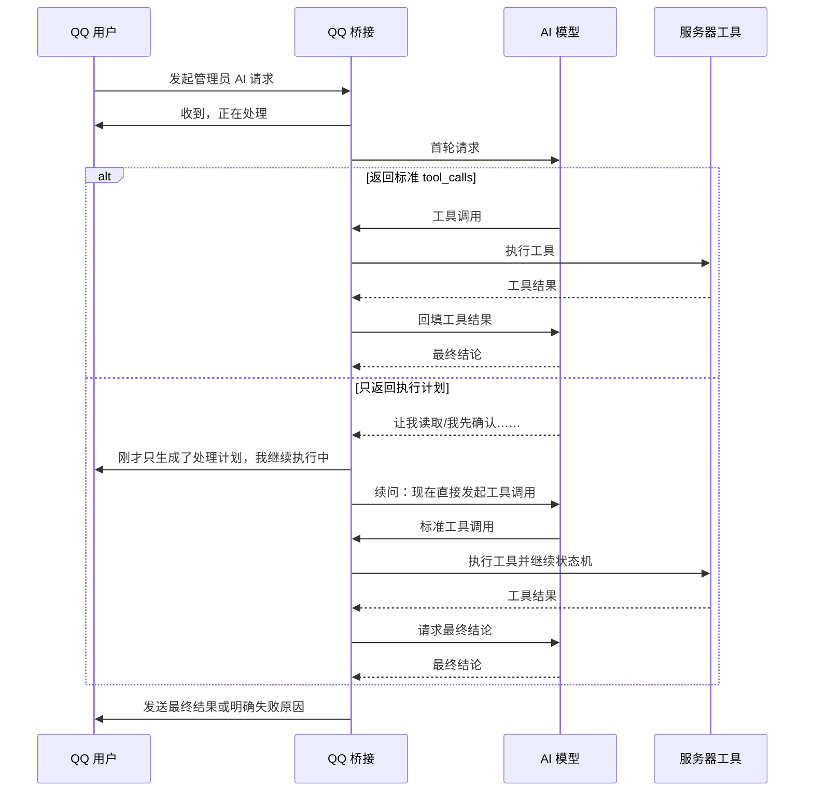

# QQ AI 连续回复优化与测试记录

日期：2026-08-18
范围：`tools/QQConsoleBridge.java` 的 AI 工具调用与 QQ 回复链路

## 1. 原问题

模型首轮返回了类似下面的普通文本：

> 我先确认一下当前配置原文，然后改成 true。让我读取配置文件。

这段内容只是执行计划，并不是标准 `tool_calls`。旧流程在发现 `tool_calls` 为空后，直接把它当成最终答案发送，所以用户看到机器人像是“回复到一半就停了”。

## 2. 新流程



## 3. 安全边界

- 只有管理员请求才会触发“计划文本续问”，避免普通聊天被误判。
- 默认最多自动恢复 1 次；正常问答不会额外增加请求。
- 单个工具默认最多执行 60 秒，整次 AI 请求共享 120 秒总预算。
- 工具超时或状态未知时，回复会明确提示“结果待核实”，不会盲目重复可能产生修改的操作。
- 修改前仍遵循原有备份、权限和高危操作确认机制。
- 本次 `tools/ops-config.json` 未修改。

## 4. 已完成的测试

### 4.1 离线状态机回归

使用模拟模型强制构造截图中的异常顺序：

1. 首轮只返回“让我读取配置文件”，不返回 `tool_calls`。
2. 续问轮返回一个模拟 `read_file` 工具调用。
3. 最后一轮返回最终结论。

测试结果：

- 模型请求：3 次
- 工具调用：1 次
- 连续处理进度提示：1 条
- 最终答案：正常返回
- 未读取、修改或发送真实服务器/QQ 数据

### 4.2 生产桥接核验

- Java 17 编译通过。
- `--ai-status` 配置读取通过。
- QQ 桥接进程已重新加载并保持运行。
- 启动错误输出为空。
- 现有 `ops-config.json` 与备份哈希一致。

## 5. 正确的 QQ 群实测

不要用 `.java` 文件测试 `read_file`。当前工具为降低误读和敏感源码暴露风险，只允许读取 `.toml`、`.json`、`.txt`、`.properties`、`.lang` 等文本配置/数据文件；`.java` 不在白名单内。

建议在管理员主群发送只读请求：

```text
@自由如风 请读取 config/slashblade-common.toml，告诉我 friendly_enable 当前值，不要修改任何文件
```

预期流程：

```text
收到，正在处理
→（如果模型先输出执行计划）刚才只生成了处理计划，我继续执行中
→ 最终返回 friendly_enable 的实际值
```

查看日志时搜索以下关键词：

```text
AI 输出了未执行计划
AI 工具调用
AI 回复完成
```

说明：模型不一定每次都会故意先输出计划，因此 QQ 实测主要验证真实模型、工具和消息发送链路；“计划文本自动恢复”分支已经通过离线回归精确验证。

## 6. 回滚

本次修改前的源码、配置和编译类备份位于：

```text
tmp/backups/qq-console-ai-flow-20260818-152648/
```

QQ 桥接重载脚本：

```powershell
powershell -ExecutionPolicy Bypass -File .\tools\reload-qq-console.ps1 -NoPause
```
