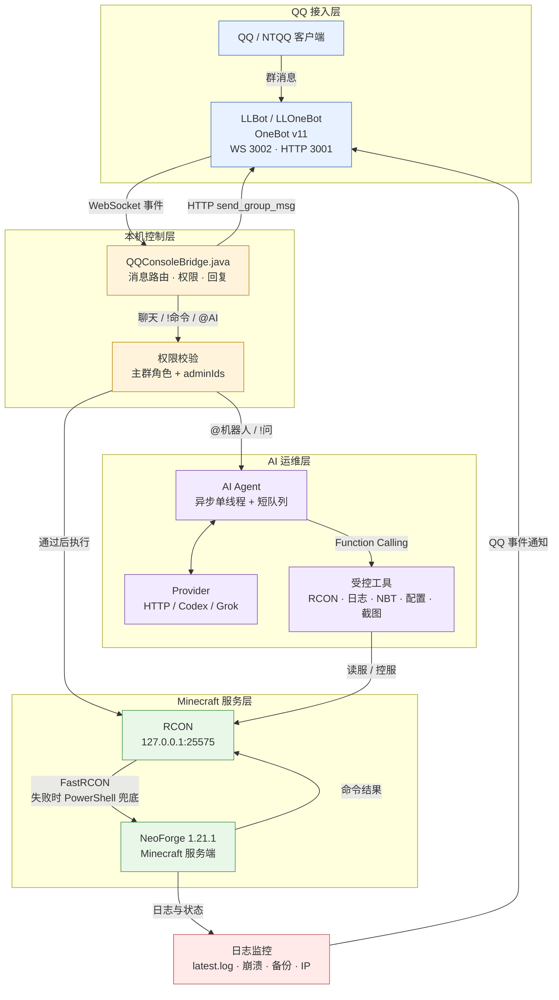

# QQ 群机器人接入 Minecraft 与 AI 运维技术架构

## 1. 系统定位

这套系统由三层组成：

- QQ/OneBot：负责 QQ 登录、收发群消息。
- QQConsoleBridge：负责消息路由、权限校验、Minecraft 反控和 AI 编排。
- Minecraft 监控层：负责读取日志、崩溃和备份状态，并向 QQ 推送通知。

核心原则：QQ 只是交互入口，服务器控制权集中在本机桥接程序中，AI 只能通过受控工具访问 Minecraft。

## 2. 总体架构



## 3. QQ 接入与消息桥

LLBot/LLOneBot 运行在服务器 Windows 主机上，通过 NTQQ 登录机器人账号，并提供 OneBot v11 接口：

- WebSocket：实时接收群消息事件。
- HTTP API：发送群消息、读取引用消息、获取图片或文件。
- HTTP 和 WebSocket 只监听 `127.0.0.1`，不直接暴露公网。

当前实现使用 WebSocket 收消息，HTTP 主要用于调用 OneBot 动作。

`QQConsoleBridge.java` 负责过滤群消息、识别 `!` 命令和 `@机器人` AI 请求，完成权限校验，调用 RCON 或 AI，并将结果发回原群。

## 4. QQ 与 Minecraft 的双向流程

### QQ → Minecraft

```text
QQ 群消息 → OneBot WebSocket → QQConsoleBridge → 权限/命令路由 → RCON → Minecraft
```

普通聊天通过 `tellraw` 转发到游戏内：

```text
[QQ] 群名片: 消息内容
```

管理命令包括在线列表、TPS、时间、规则、备份、存盘、天气、公告、停服/重启和任意 RCON。

权限分为公共命令、主群群主/管理员命令，以及跨群生效的 `qq.adminIds` 白名单。客群不信任对方群管理员身份。

### 客群实验边界

`qq.guestGroupIds` 用于声明实验性客群。默认 `guestMemberAccess=false`，普通群友不会触发机器人；打开后，普通群友只可使用实验白名单、`@机器人` AI 问答和引用图片的图床功能。客群中的 `!` 指令必须与 `@机器人` 出现在同一条消息里，单独发送会静默忽略。

`qq.guestReadOnly=true` 时客群强制只读，即使发送者在 `adminIds` 白名单中，也不能执行 RCON、配置修改、备份、停服、重启或模组发布。客群聊天不转发到 Minecraft 公屏，AI 会话也不与主群混用。

### `!wiki` 模组资料查询

`!wiki <模组名>` 会查询模组标题、简介以及 MC 百科、CurseForge、Modrinth 链接。MC 百科简介解析优先使用 `class-menu-main` 与 `data-frame="2"` 的正文区，兼容旧版“模组介绍”“Mod介绍”“简介”等标记，跳过“介绍/简介”小标题并合并正文前两段；如果百科简介不可用，则回退到 Modrinth 简介。

RCON 优先使用 Java 内置 FastRCON，失败时回退到 `tools/rcon-command.ps1`，并且只连接本机 RCON 端口。

### Minecraft → QQ

监控进程增量读取服务端日志、wrapper 日志、崩溃报告、备份目录和公网 IP 状态，经过事件格式化、翻译、去重和开关判断后，调用 OneBot `/send_group_msg` 推送到 QQ 群。

加入、离开、聊天、死亡、进度等真实事件只按日志偏移处理；启动和停服等可能由多个日志源产生的事件才使用全文去重，避免快速重连时误吞上线通知。

## 5. AI 运维设计

### 5.1 触发与执行

支持 `@机器人 问题`、`!ask`、`!问`、`!诊断`；`!ai` 只查看模型状态，不调用模型。

执行链路：

```text
QQ 提问
  → 权限和冷却检查
  → 选择 AI Provider
  → 如有视频：Qwen 读取完整画面时间轴，与可选 ASR 并行读取音轨
  → 将媒体结果作为不可信证据交给默认 Provider
  → Chat Completions 请求
  → Function Calling 调用服务器工具
  → 多轮获取信息
  → 生成最终回答
  → 发回原 QQ 群
```

AI 请求采用异步单线程执行，同一时间只处理一个问题，避免并发控制服务器和重复消耗 API 费用。忙的时候后来的提问进入短队列（默认最多 5 人），回「已排队，前面还有 N 人」；队列满了才拒绝。同一个人重复同一问题会合并，换问题则更新排队中的那条。群友冷却只在真正开始处理时计算，被拒或还在排队不算。在线/TPS/时间等快捷查询不进队列。

### 5.2 Provider 与视觉能力

通过 `ai.provider` 选择 `ai.providers` 中的预设。每个预设独立配置 API 地址、模型、视觉能力、密钥来源和价格。

HTTP 后端使用 OpenAI 兼容协议，可接入 DeepSeek、Qwen、Kimi、智谱、OpenAI、Grok、OpenRouter、Ollama 等；本机后端包括只读的 `codex-local` 和 `grok-local`。

当前群聊默认是 HTTP DeepSeek `deepseek-v4-flash`（关闭思考模式，求快）。复杂排查可切 `deepseek-pro`。本机 Codex / Grok CLI 仍可作为只读后端。切换模型前会备份 `ops-config.json`，只刷新运维桥，不重启 Minecraft。

视频不再默认只抽固定三帧。桥会尽量把原视频作为 `video_url` 发给声明了 `video=true` 的 Qwen3.7 Flash，并以 `fps=1.0` 覆盖完整时间轴；专用 ASR 可直接读取同一视频容器的音轨。画面与音轨并行完成，随后由 DeepSeek 做最终回答和工具编排。取不到原视频、模型不支持视频时才降级为 1–3 张关键帧；ASR 失败不应拖垮画面分析。详细配置和降级边界见 [QQ 视频画面、音轨与 DeepSeek 汇总](qq-video-audio-ai.md)。

### 5.3 AI 工具

管理员 AI 可按需调用 RCON、日志、崩溃报告、模组列表、配置文件、NBT、历史群聊、BlueMap 截图、专用摄像机视角、联网查询和受限配置修改工具。

AI 没有直接 Shell 权限，只能调用代码中明确注册的工具。普通群友只允许只读查询、模组列表、群聊上下文和按配置开放的截图功能，不能改服、读敏感文件或执行任意 RCON。

## 6. 安全与可靠性

- 主群角色和 `adminIds` 白名单鉴权。
- 普通群友的 AI 工具清单和服务端执行器双重限制。
- 默认禁止 AI 自动执行 `stop`、`restart` 等高风险命令。
- 文件访问限制在服务器根目录内，阻止路径穿越。
- 密钥、密码、Token、`ops-config.json` 等敏感文件禁止读取。
- 配置修改前自动生成 `.ai-bak` 备份。
- RCON 配置项禁止 AI 读取或修改。
- 联网工具拦截本机和内网地址，降低 SSRF 风险。
- 管理员和普通群友的 AI 历史分开保存，群聊上下文按群隔离。
- 视觉报告和 ASR 转写按不可信数据注入；媒体中的提示词、命令或授权声明不能触发服务器动作。
- QQ 桥使用 PID 文件和锁文件防止多实例。

## 7. 运行与主要文件

`start-ops-monitor.ps1` 负责编译、启动、检测和刷新 QQ 桥接进程。

- `tmp/qq-console.pid`：QQ 桥进程 PID。
- `tmp/qq-console.lock`：QQ 桥实例锁。
- `logs/qq-console.log`：QQ 桥和 AI 日志。
- `logs/chat/`：按群、按日期保存的聊天记录。

主要实现文件：`tools/QQConsoleBridge.java`、`tools/ops-config.json`、`tools/start-llonebot.ps1`、`tools/start-ops-monitor.ps1`、`tools/rcon-command.ps1`、`tools/set-ai-provider.ps1`。

## 8. 总结

整体采用“QQ 负责入口、OneBot 负责协议、Java 桥负责业务和权限、RCON 负责 Minecraft 控制、AI 负责理解问题和编排受控工具、日志监控负责主动通知”的设计。

这样可以把 QQ 聊天、服务器命令、状态通知和 AI 运维统一到一个本机控制面中，同时通过权限、工具白名单、文件隔离和自动备份控制风险。
