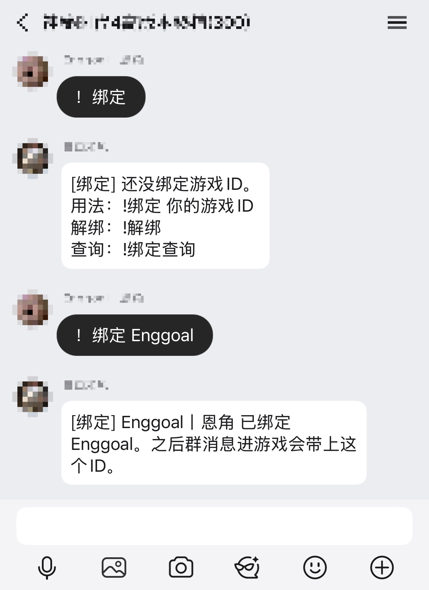
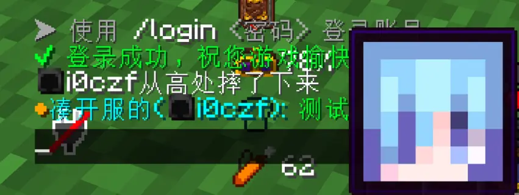

# QQ 号与游戏 ID 绑定

本功能接在现有 QQ 桥上，对照 [PF-GUGUBot](https://github.com/PFingan-Code/PF-GUGUBot) 的绑定思路实现，**不引入 MCDR，也不另起机器人**。开启后，QQ 号可以和本服游戏 ID 一对一绑定；主群消息转发到 Minecraft 时，公屏会同时显示群名片和游戏 ID。如果已经按 [QQ 图片转图床说明](qq-image-host-转图床.md) 接入 ChatImage，把鼠标放到名字前的 `●` 上还能看到该角色的皮肤头像。

## 能力与权限

| 身份 | 命令 | 作用 |
|---|---|---|
| 群成员 | `!绑定 Steve` | 把自己的 QQ 号绑定到游戏 ID |
| 群成员 | `!绑定` / `!绑定查询` | 查询自己的绑定 |
| 群成员 | `!解绑` | 解绑自己 |
| 群成员 | `!id` | 查看自己的 QQ 号和绑定状态 |
| 管理员 | `!绑定 @某人 Steve` | 代其他 QQ 号绑定 |
| 管理员 | `!解绑 @某人` 或 `!解绑 Steve` | 代其他 QQ 号解绑 |
| 管理员 | `!绑定列表` | 查看完整绑定列表 |
| 管理员 | `!绑定提醒` | 看提醒开关、冷却、本进程已提醒人数 |
| 管理员 | `!绑定提醒 关` / `!绑定提醒 开` | 立刻停/恢复未绑定轻提醒 |
| 管理员 | `!未绑定` | 列最近在主群说过话、还没绑的人（完整 QQ 仅管理员可见） |
| 群成员 | `!转发` | 看 QQ↔游戏聊天转发是开还是关 |
| 管理员 | `!转发 关` / `!转发 开` | 立刻停/恢复双向聊天转发（进退服、成就、备份、崩溃通知还在） |

半角 `!` 和全角 `！` 都支持。若客群配置要求必须 @ 机器人，则按该桥接的客群规则使用，例如 `@机器人 !绑定 Steve`。客群没有绑定提醒，也没有 `!转发` / `!未绑定`。

默认规则如下：

- 一个 QQ 默认只能绑定一个游戏 ID，再次绑定会改绑；一个游戏 ID 不能同时被多个 QQ 占用。
- `requireSeenOnServer=true` 时，游戏 ID 必须先在本服上线过，避免误绑不存在或未使用的角色。
- 普通成员查询其他人时不显示对方完整 QQ 号；完整列表和代操作需要管理员权限。
- `showSkinHead=true` 时尝试复用已有皮肤同步与图床链路。皮肤站、图床或客户端预览不可用时，绑定文字仍正常显示。
- 绑定数据位于 `logs/qq-player-binds.json`，属于运行时玩家数据，不能提交到公开仓库。

## 游戏里长什么样

绑定后，群消息的发送者会按群名片和游戏 ID 组合显示；两者相同时只显示一次。群消息里的 `@QQ` 在对方已绑定时会显示成 `@游戏ID`。反过来：游戏里喊 `@Steve`，主群这条 `[聊天]` 会真 @ 到绑定这个 ID 的 QQ；没绑的名字保持原文，邮箱和网址里的 `@` 不会乱点。没绑定的人仍只显示群名片。

没绑的人在主群说闲话时，大约 5 秒后可以收到一句去 `!绑定` 的轻提醒，同一人默认 6 小时只提一次。主群不全是玩服的人时，建议保持关闭；管理员随时发 `!绑定提醒 开|关`。客群不提醒、也不转发闲聊。

已绑定示例：

```text
[主群] ●群名片(Steve): 晚上好
```

群名片和游戏 ID 一样时：

```text
[主群] ●Steve: 晚上好
```

`●` 复用现有 ChatImage 悬停预览：先按游戏名同步皮肤头像，再上传到本机图床。图床、皮肤站或客户端没有 ChatImage 时，名字和游戏 ID 照常显示，只是没有头像。

## 配置

配置位于 `tools/ops-config.json` 的 `qq.playerBind`。公开模板 `tools/portable-ops-config.example.json` 默认将 `enabled` 设为 `false`，复制到本机后按实际环境启用：

```json
"playerBind": {
  "enabled": false,
  "memberAccess": true,
  "requireSeenOnServer": true,
  "showSkinHead": true,
  "remindUnbound": false,
  "remindCooldownMinutes": 360,
  "maxPerQq": 1,
  "namePattern": "^[A-Za-z0-9_]{1,16}$",
  "store": "logs/qq-player-binds.json"
}
```

`!转发` 和 `!绑定提醒` 的运行时开关不写进 `ops-config.json`，分别落在 `logs/qq-chat-relay.json` 和 `logs/qq-bind-remind.json`。热重载 QQ 桥后这两个开关还在；提醒冷却只记内存，重载会丢。

改完配置后只需热重载 QQ 桥。改了 `discord-watch.ps1`（游戏 `@ID` 点 QQ）后再热更运维监控。不要把真实 `ops-config.json`、绑定 JSON、日志、QQ 登录资料或图床令牌提交到仓库。

## 热重载与离线自测

```powershell
.\tools\reload-qq-console.ps1 -NoPause
```

无需连接 QQ 的离线自测：

```powershell
javac --add-modules jdk.httpserver -encoding UTF-8 -Xlint:all `
  -d tmp/java-classes tools/QQConsoleBridge.java
java -cp tmp/java-classes QQConsoleBridge --bind-selftest
```

预期输出为 `PASS player-bind selftest`。自测只校验游戏 ID 格式、QQ/ID 绑定解析、序列化往返和临时文件写入，不会启动 QQ 桥或连接 OneBot。

## 实服测试截图

NeoForge 1.21.1 / 21.1.235 实服。QQ 侧头像和群名已打码；截图只保留命令、绑定回执、游戏公屏和头像预览，不含 QQ 号、群号、域名、IP 或密钥。

群里先查自己还没绑，再发 `！绑定 Enggoal`，机器人确认已绑定：



绑定后的群消息进入游戏：公屏显示群名片和游戏 ID，悬停 `●` 预览该角色皮肤头像：



## 回滚

回滚时恢复 QQ 桥源码和配置的本机备份，再热重载 QQ 桥即可。删除 `logs/qq-player-binds.json` 只会清空绑定关系，不影响 QQ 桥的其他配置和功能；操作前请先确认这是预期行为。
